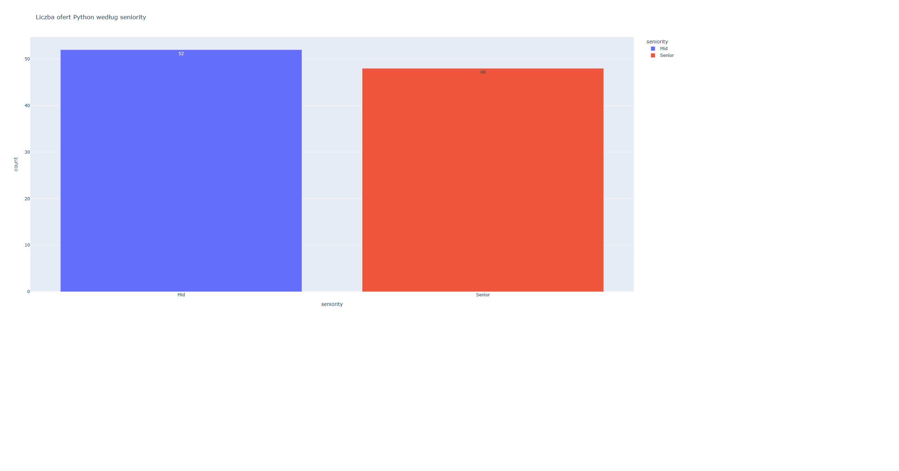
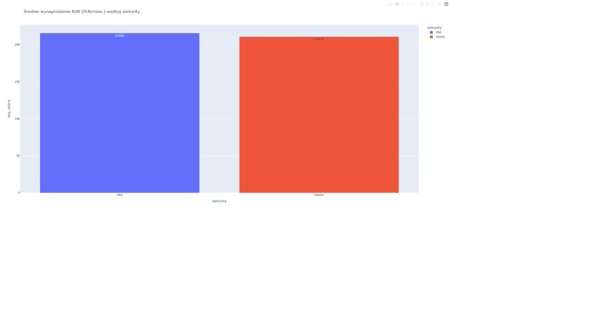
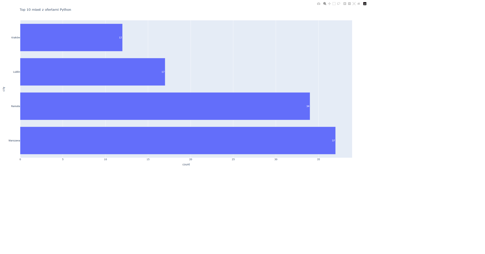
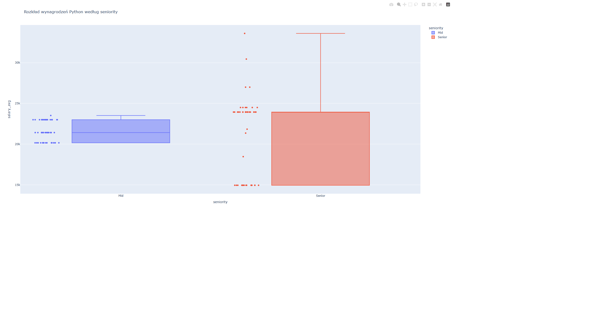

# Python Job Market Scraper & API

> Projekt zbiera, analizuje i udostępnia przez REST API oferty pracy dla Python developerów z portalu **NoFluffJobs**.


---

## Key Findings (dane z maja 2026)

| Wskaźnik                    | Wartość                           |
| --------------------------- | --------------------------------- |
| Średnie wynagrodzenie B2B   | **21 332 PLN / mies.**            |
| Najpopularniejsze lokalizacje | **Warszawa (37%) i Remote (34%)** |
| Rozkład seniority           | **Mid 52% vs Senior 48%**         |
| Rozpiętość płac             | **14 580 – 36 960 PLN**           |
| Top miasto poza Warszawą  | **Kraków i Lublin**               |

---

## Wizualizacje

### Liczba ofert według seniority



### Średnie wynagrodzenie B2B według seniority



### Top 10 miast z ofertami Python



### Rozkład wynagrodzeń (box plot)



> Wykresy są interaktywne — po uruchomieniu projektu lokalnie otwórz pliki `.html` z folderu `analysis/`

---

## Tech Stack

| Warstwa            | Technologie                 |
| ------------------ | --------------------------- |
| **Scraping**       | `requests`, NoFluffJobs API |
| **Analiza danych** | `pandas`                    |
| **Wizualizacje**   | `plotly`                    |
| **REST API**       | `FastAPI`, `uvicorn`        |
| **Dane**           | CSV (100+ ofert)            |

---

## Struktura projektu

```
Job-Scraper/
├── scraper/
│   └── scraper.py          # pobieranie danych z NoFluffJobs API
├── analysis/
│   ├── analyze.py          # analiza pandas + generowanie wykresów
│   ├── chart_seniority.html
│   ├── chart_salary_seniority.html
│   ├── chart_cities.html
│   └── chart_salary_box.html
├── api/
│   └── main.py             # REST API z dokumentacją Swagger
├── data/
│   └── jobs.csv            # zebrane dane (generowane przez scraper)
├── requirements.txt
└── README.md
```

---

## Instalacja i uruchomienie

### 1. Klonowanie repozytorium

```bash
  git clone https://github.com/MarcinMarekRuman/Job-Scraper.git
  cd Job-Scraper
```

### 2. Instalacja zależności

```bash
  pip install -r requirements.txt
```

### 3. Pobierz dane (scraper)

```bash
  python scraper/scraper.py
```

Dane zostaną zapisane do `data/jobs.csv`.

### 4. Uruchom analizę i wykresy

```bash
  python analysis/analyze.py
```

Wykresy HTML pojawią się w folderze `analysis/`.

### 5. Uruchom API

```bash
  uvicorn api.main:app --reload
```

API będzie dostępne pod adresem `http://localhost:8000`

---

## API Endpoints

| Metoda | Endpoint         | Opis                        |
| ------ | ---------------- | --------------------------- |
| `GET`  | `/`              | Informacje o API            |
| `GET`  | `/jobs`          | Lista ofert z filtrami      |
| `GET`  | `/jobs/{job_id}` | Szczegóły konkretnej oferty |
| `GET`  | `/stats`         | Statystyki rynku            |
| `GET`  | `/docs`          | Dokumentacja Swagger UI     |

### Przykłady użycia

```bash
    # Wszystkie oferty
    GET /jobs
    
    # Oferty z Warszawy
    GET /jobs?city=Warszawa
    
    # Tylko Senior, praca zdalna
    GET /jobs?seniority=Senior&remote=true
    
    # Z minimalnym wynagrodzeniem 25 000 PLN
    GET /jobs?min_salary=25000
    
    # Statystyki rynku
    GET /stats
```

### Przykładowa odpowiedź `/stats`

```json
{
  "total_jobs": 100,
  "avg_salary_b2b": 21332.0,
  "median_salary": 21420.0,
  "min_salary": 14580.0,
  "max_salary": 36960.0,
  "top_cities": {
    "Warszawa": 37,
    "Remote": 34,
    "Lublin": 17,
    "Kraków": 12
  },
  "seniority_split": {
    "Mid": 52,
    "Senior": 48
  },
  "remote_count": 34
}
```

---

## Konfiguracja scrapera

W pliku `scraper/scraper.py` możesz zmienić parametry wyszukiwania:

```python
# Zmień keyword na dowolny język/technologię
scrape_jobs(keyword="javascript", max_pages=5)
scrape_jobs(keyword="react", max_pages=3)

# Zwiększ max_pages żeby pobrać więcej ofert
scrape_jobs(keyword="python", max_pages=10)
```

---

## Wymagania

```
requests
pandas
plotly
fastapi
uvicorn
```

Instalacja:

```bash
  pip install -r requirements.txt
```

---

## Autor

**Marcin Ruman** — Fullstack Developer

[](https://www.linkedin.com/in/marcinmarekruman)
[](https://github.com/MarcinMarekRuman)
[](https://marcinmarekruman.github.io/PortfolioReact/)
